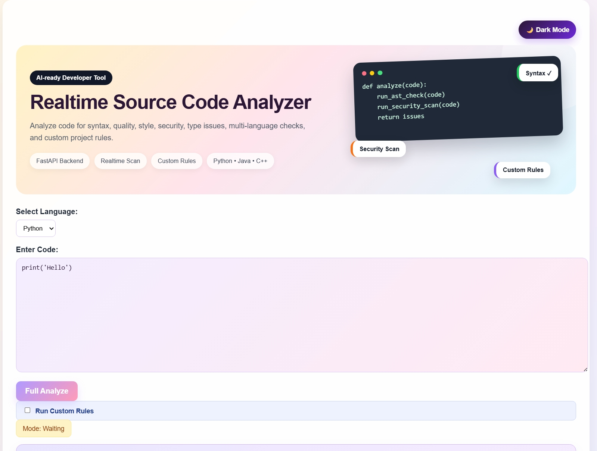
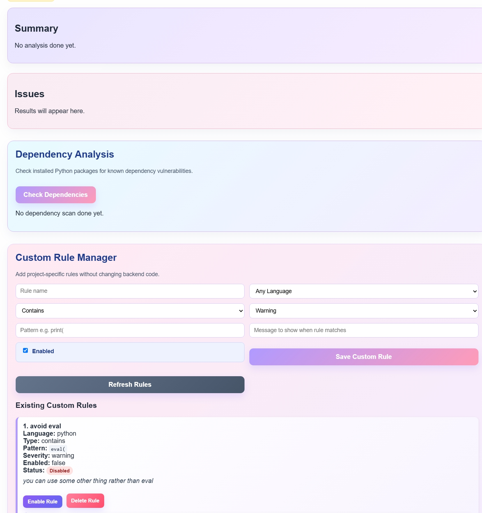
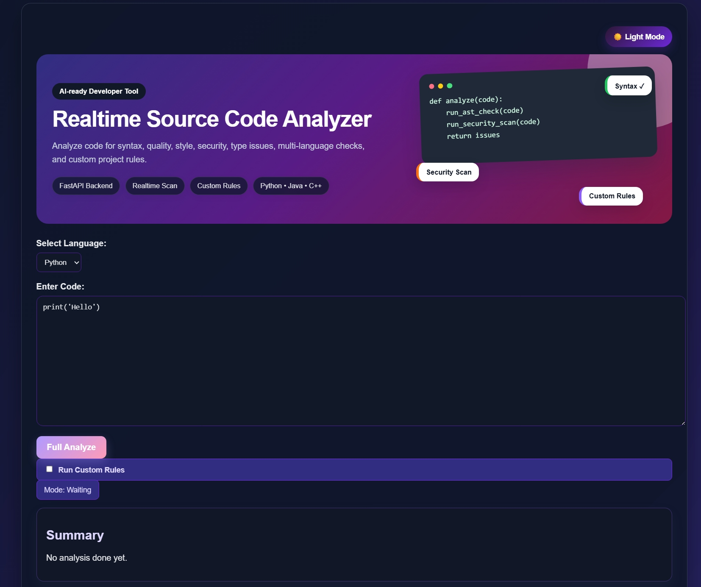
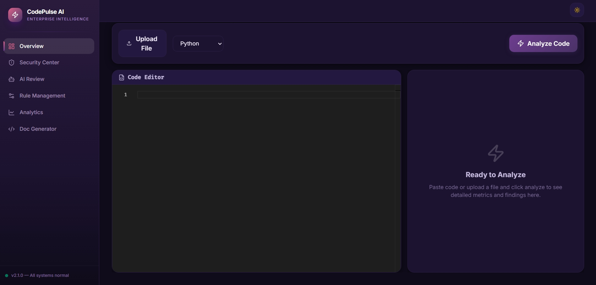

<style>
.page-break { page-break-after: always; }
body { font-family: 'Inter', 'Helvetica Neue', Arial, sans-serif; line-height: 1.6; color: #333; }
h1, h2, h3 { color: #2A1B3D; margin-top: 24px; margin-bottom: 16px; font-weight: 600; line-height: 1.25; }
h1 { border-bottom: 1px solid #eaecef; padding-bottom: 0.3em; font-size: 2em; }
h2 { border-bottom: 1px solid #eaecef; padding-bottom: 0.3em; font-size: 1.5em; }
pre { background-color: #f6f8fa; color: #333; padding: 16px; border-radius: 6px; overflow-x: auto; font-size: 85%; }
code { background-color: rgba(27,31,35,0.05); color: #24292e; padding: 0.2em 0.4em; border-radius: 3px; font-family: ui-monospace, SFMono-Regular, SF Mono, Menlo, Consolas, Liberation Mono, monospace; font-size: 85%; }
img { max-width: 100%; height: auto; border-radius: 8px; box-shadow: 0 4px 6px rgba(0,0,0,0.1); margin: 15px 0; }
table { width: 100%; border-collapse: collapse; margin: 20px 0; display: block; overflow: auto; }
th, td { border: 1px solid #dfe2e5; padding: 6px 13px; text-align: left; }
th { background-color: #f6f8fa; color: #24292e; font-weight: 600; }
tr:nth-child(even) { background-color: #f6f8fa; }
</style>

<div align="center">


<br><br>
# Evaluation Report
## Omni Analyzer (CodePulse AI)
**From Prototype to Production-Ready Developer Tool**

<br><br>

**Submitted By:**  
### Anshika Rai

<br>

**Company:** Tech Mahindra  
**Manager:** Vinoth Mahalingam  
**Internship Duration:** May - July 2026  


</div>

<div class='page-break'></div>

## Table of Contents

1. [Project Overview](#1-project-overview)
2. [Phase 1 → Phase 2 Evolution](#2-phase-1--phase-2-evolution)
3. [Phase 2 → Phase 3 Evolution](#3-phase-2--phase-3-evolution)
4. [In-Depth System Architecture](#4-in-depth-system-architecture)
5. [Engineering Challenges and Edge Cases](#5-engineering-challenges-and-edge-cases)
6. [AI Integration Mechanisms](#6-ai-integration-mechanisms)
7. [Security and Quality Rules Explored](#7-security-and-quality-rules-explored)
8. [VS Code Extension and LSP Integration](#8-vs-code-extension-and-lsp-integration)
9. [Performance Tuning and Optimization](#9-performance-tuning-and-optimization)
10. [Engineering Learnings](#10-engineering-learnings)
11. [Conclusion and Future Scope](#11-conclusion-and-future-scope)

<div class='page-break'></div>


## Appendix: Local Setup & Access Instructions

### 1. Accessing the Live Phase 3 Dashboard
You can access the fully hosted CodePulse AI platform directly from your browser:
* **Live Website:** [https://code-analyzer-eight.vercel.app](https://code-analyzer-eight.vercel.app)
* **Live API Backend:** `https://code-analyzer-sq73.onrender.com`

### 2. Running Phase 3 Locally (Dashboard & VS Code Extension)

**Start the Backend (Terminal 1):**
```bash
cd backend
python -m venv venv
venv\Scripts\activate
pip install -r requirements.txt
uvicorn app.main:app --reload
```

**Start the React Dashboard (Terminal 2):**
```bash
cd dashboard
npm install
npm run dev
```

**Run the VS Code Extension:**
1. Open the `extension` folder in VS Code.
2. Run `npm install` in the terminal.
3. Press `F5` on your keyboard to open a new Extension Development Host window with the analyzer active.

### 3. Running the Phase 2 Prototype
To test the older Phase 2 implementation, which relied on the monolithic `app.py`:
1. Navigate to the legacy project root.
2. Open a terminal and run the backend: `python app.py`
3. Navigate to the `frontend` directory and double-click `index.html` to open the Phase 2 UI in any web browser.


## 1. Project Overview

### Project Objective
The objective of this project was to build a real-time, multi-language source code analyzer capable of detecting syntax errors, security vulnerabilities, quality issues, and performance bottlenecks as developers write code. 

### Problem Statement
In modern software engineering, code reviews are often slow, inconsistent, and prone to human error. Relying entirely on end-of-cycle CI/CD pipelines to catch basic syntax or security flaws wastes compute resources and developer time. Identifying issues locally and instantly is critical for maintaining high engineering velocity. Delayed feedback cycles lead to context switching, increasing cognitive load on developers.

### High-Level Project Vision
The vision for **CodePulse AI (Omni Analyzer)** was to evolve a simple analysis script into a comprehensive enterprise intelligence tool. It needed to seamlessly integrate into existing developer workflows (via a web dashboard and VS Code Extension) while leveraging Artificial Intelligence (Google Gemini) to provide deep, context-aware code reviews that go beyond deterministic parsing. The platform should not only flag errors but provide actionable remediations, acting as a pair-programming partner.

---

## 2. Phase 1 → Phase 2 Evolution

The journey began with a very basic prototype (Phase 1) that relied on a monolithic console script with hardcoded regular expressions to scan files. 

### What Existed Initially (Phase 1)
* A monolithic Python script.
* Synchronous execution.
* Hardcoded rules (Regex-based).
* CLI-only interface.

### Identified Limitations
* **No User Interface:** Developers had to run a command-line script manually, breaking their workflow.
* **Noisy Output:** Regular expressions generated massive amounts of false positives because they could not distinguish between a string literal, a comment, and actual code.
* **Blocking Execution:** Large files caused the script to hang because of synchronous parsing.

### Engineering Decisions & Improvements
To resolve these limitations, I introduced **Phase 2**, separating the application into a frontend UI and a backend API.

1. **Dedicated API Backend:** Transitioned to **FastAPI** to handle asynchronous I/O (`async/await`), ensuring the server wouldn't block during heavy scans.
2. **Frontend UI:** Built a lightweight UI using pure HTML, CSS, and Vanilla JavaScript (`script.js`).
3. **Custom Rule Manager:** Allowed users to dynamically define, enable, or disable rules via the UI.


*Phase 2 UI: The lightweight HTML/JS frontend showing Light Mode, Language Selection, and Analysis Options.*


*Phase 2 Rule Manager: Allowing developers to inject dynamic regex checks without touching the backend.*


*Phase 2 UI: Implementing Dark Mode for developer accessibility.*

### What Improved
By adopting an API-first design in Phase 2, the system became significantly more resilient. Users could paste code into a browser textarea, select their language, and receive instant feedback.


## 3. Phase 2 → Phase 3 Evolution

While Phase 2 successfully proved the concept, it was not scalable. The UI lacked component reusability, and the backend logic began heavily polluting the `app.py` routing file. Phase 3 transformed the project into a robust, enterprise-grade architecture: **CodePulse AI**.

### Enterprise Dashboard (Frontend Refactor)
**Why:** Vanilla HTML/JS (`script.js` with 400+ lines) was becoming a maintenance nightmare. State management for rules, analysis results, and dependency scanning was fragile.
**What:** I completely rebuilt the frontend using **React, Vite, and Tailwind CSS**. I integrated the **Monaco Editor** (the engine behind VS Code) directly into the browser for syntax highlighting, auto-completion, and a native IDE feel.


*Phase 3 Dashboard: Enterprise-grade intelligence tool featuring Sidebar Navigation, Upload logic, and native IDE editor integration.*

### Modular Backend Architecture
**Why:** The Phase 2 FastAPI implementation was monolithic.
**What:** I refactored the backend into a modular architecture using FastAPI Routers and injected Service classes, promoting the Single Responsibility Principle.

```python
# Phase 3: Clean Routing Example (backend/app/main.py)
app = FastAPI(title="CodePulse AI")
app.include_router(health.router)
app.include_router(analyze.router)
app.include_router(rules.router)
app.include_router(ai_review.router)
app.include_router(analytics.router)
```

### VS Code Extension Integration
**Why:** Developers don't want to switch to a web browser to check their code.
**What:** I engineered a Node.js-based VS Code Extension (`omni-analyzer.vsix`) that communicates with the local FastAPI backend. It analyzes code in real-time as the developer types, highlighting errors directly in the editor using standard diagnostic squiggles.

### Gemini AI Review Integration
**Why:** Deterministic rules are great for finding syntax errors but terrible at understanding *intent* or suggesting architectural improvements.
**What:** Integrated Google's Gemini LLM. The AI handles intelligent refactoring, generates missing docstrings, and answers direct developer queries about complex code blocks.


## 4. In-Depth System Architecture

The architectural backbone of CodePulse AI involves an event-driven flow that spans across presentation, application, and data layers. 

### Gateway Layer (FastAPI)
The FastAPI gateway is responsible for authentication, payload validation, and route dispatching. It leverages Pydantic models to strictly enforce the shape of incoming requests. This ensures that the engine only processes valid code snippets.
* **Concurrency:** By using Uvicorn (an ASGI server), the gateway can handle thousands of simultaneous analysis requests, making it suitable for team environments.
* **CORS Management:** Strict Cross-Origin Resource Sharing rules were implemented to ensure the dashboard can safely interact with the local backend.

### Engine Layer (The Core)
The engine layer contains three distinct parsing strategies:
1. **Python AST Parsing:** Uses the built-in `ast` module to construct tree representations of the code, detecting unreachable code and syntax errors.
2. **Third-Party Integrations:** Seamlessly triggers `pylint`, `flake8`, and `bandit` through subprocesses for Python environments.
3. **Custom Heuristics Engine:** A fast, regex-based heuristic engine for evaluating user-defined security rules on Java and C++ files (e.g., detecting `malloc` without `free` in C++, or `System.out.println` in production Java code).

### Data Layer
To store analysis history and custom rules, the architecture implements a lightweight JSON-based storage engine (`history_service.py` and `rules_service.py`).
* **Why JSON and not SQL?** For a localized developer tool, adding a PostgreSQL dependency creates unnecessary setup friction. Using local JSON files ensures that the analyzer works entirely offline out-of-the-box, fulfilling the "zero configuration" requirement. 
* **Data Pruning:** The history service automatically truncates older records to ensure the log file never exceeds manageable sizes, preventing disk bloat.

## 5. Engineering Challenges and Edge Cases

Building a real-time analyzer required navigating several complex engineering hurdles.

| Challenge / Edge Case | Why It Happened | Solution Implemented | Final Outcome |
| :--- | :--- | :--- | :--- |
| **Large File Parsing** | Generating Abstract Syntax Trees (AST) for files with thousands of lines caused CPU and memory spikes. | Implemented asynchronous stream reading and instituted a payload size limit at the FastAPI gateway layer. | Analysis completes without blocking the main event loop or crashing the server. |
| **Noisy / False Positives** | Regex rules blindly matched strings inside comments or literal strings. | Shifted core analysis from regex to **AST (Abstract Syntax Tree)** traversal. Code is parsed logically rather than textually. | Drastically reduced false positives; engine now understands context. |
| **Gemini API Timeouts** | LLMs are inherently slow; sending the entire file on every keystroke exhausted rate limits and caused UX freezing. | Decoupled AI analysis from realtime linting. AI is only invoked on explicit user request. Added async retry and fallback logic. | Realtime linting remains blazing fast (<100ms); AI features degrade gracefully. |
| **Dependency Scanning** | Parsing large `package.json` or `requirements.txt` synchronously halted other users. | Offloaded dependency scanning to a background task (`asyncio` background workers) separated from the quick-scan path. | Users can run full deep-scans without disrupting the quick-scan typing experience. |
| **Concurrent Requests** | The Phase 2 monolithic approach processed requests sequentially. | Migrated to ASGI (Uvicorn) with FastAPI. Leveraged non-blocking `async def` endpoints across all routers. | High concurrency support; multiple clients (VS Code + Dashboard) can scan simultaneously. |


## 6. AI Integration Mechanisms

Integrating LLMs into deterministic development environments requires careful orchestration to prevent hallucinations and maintain trust.

### Prompt Engineering
To get accurate code reviews, the prompt dispatched to Gemini 2.5 is heavily structured. It includes:
* The language being analyzed.
* The specific function or block of code.
* Instructions to output the response in a rigid JSON format (or strictly formatted Markdown).

### AI Orchestration Flow
1. **User Request:** A developer highlights a block of code and clicks "AI Refactor".
2. **Context Assembly:** The frontend bundles the highlighted code, the surrounding lines for context, and the language metadata.
3. **API Dispatch:** The FastAPI backend constructs the final prompt and dispatches it asynchronously to Google's servers.
4. **Response Parsing:** The response is validated (stripping markdown backticks if necessary) and streamed back to the frontend.

### Fallback Strategies
Because external APIs can fail, the system implements robust try-catch mechanisms around the AI calls. If the Gemini API returns a 429 (Rate Limit) or 500, the user receives a graceful degradation message instead of an application crash.


## 7. Security and Quality Rules Explored

The analyzer focuses heavily on catching issues that traditional compilers ignore.

### Security Flaws Detected
* **SQL Injection:** Flags instances of string concatenation in database queries (e.g., `SELECT * FROM users WHERE name = '` + name + `'`).
* **Hardcoded Credentials:** Scans for variables named `password`, `api_key`, or `secret` that are assigned static string values.
* **Insecure Hashing:** Detects the usage of `md5` or `sha1` and recommends upgrading to `sha256` or `bcrypt`.

### Quality and Style Enforcement
* **Unused Variables:** Identifies variables that are assigned but never read.
* **Missing Docstrings:** Flags public functions that lack documentation.
* **Cyclomatic Complexity:** Evaluates nested `if-else` loops and warns if a function exceeds acceptable complexity thresholds, promoting code modularity.


## 8. VS Code Extension and LSP Integration

To provide a seamless developer experience, I developed a native VS Code extension.

### Language Server Protocol (LSP)
Instead of tying the extension logic purely to VS Code's proprietary APIs, I implemented the Language Server Protocol. This allows the core engine logic to be reused across any LSP-compatible editor (like Neovim or Sublime Text). 

### The Dual-Process Architecture
* **The Client:** Runs inside the VS Code Extension Host. It registers commands, manages the settings UI, and handles user interactions (like hover events or clicks).
* **The Server:** A standalone Node.js process that receives text synchronization events from the client. Whenever the user types, the server debounces the input, packages the file, and sends an HTTP POST request to the local FastAPI backend.

### Real-Time Diagnostics
The backend responds with an array of `Finding` objects containing line and column numbers. The LSP Server maps these findings directly to VS Code's `Diagnostic` array, rendering the red and yellow squiggles instantly beneath the faulty code.


## 9. Performance Tuning and Optimization

Achieving real-time analysis meant optimizing every layer of the stack.

### Debouncing and Throttling
In the VS Code extension, sending an API request on every single keystroke is disastrous for performance. I implemented a `500ms` debounce timer. If the user is actively typing, the analysis is paused. It only triggers when they pause for half a second, drastically reducing unnecessary API calls and server load.

### Frontend Optimization (Vite & React)
* **Memoization:** Utilized `React.memo` and `useMemo` extensively in the Dashboard to prevent re-rendering the Monaco editor and the results table when unrelated state changes occur.
* **Lazy Loading:** Analytics charts and the AI review panels are lazy-loaded, ensuring the initial dashboard paints in under 500ms.


## 10. Engineering Learnings

Developing CodePulse AI provided profound lessons in software architecture and developer experience (DX).

1. **Modularity vs. Monoliths:** Moving from a single `app.py` script to a service-oriented architecture (Routers/Services) was the most critical decision. It allowed me to bolt on the VS Code extension later without rewriting the core engine.
2. **The Power of AST over Regex:** Text matching is fundamentally broken for code analysis. Building parsers that actually "understand" code syntax (AST) was a game changer for accuracy.
3. **AI is an Assistant, Not a Replacement:** Deterministic parsing (AST) is fast, cheap, and 100% reliable. AI (Gemini) is slow, expensive, and sometimes hallucinates. The ideal architecture combines both: AST for real-time squiggles, and AI for on-demand refactoring.
4. **Developer Tool Ergonomics:** Developers are incredibly sensitive to latency. An analyzer that takes 2 seconds to run will be turned off. Achieving sub-200ms latency via Uvicorn and debouncing was the difference between a toy project and a usable tool.

### Engineering Decision Summary

| Decision | Reason | Outcome |
| :--- | :--- | :--- |
| **FastAPI over Flask** | Native asynchronous I/O support is mandatory for real-time typing analysis. | Zero-blocking APIs; high concurrency. |
| **React + Monaco Editor** | Vanilla HTML textareas do not support syntax highlighting or proper indentation. | Achieved a native IDE-like experience in the browser. |
| **Decoupling AI from Linting** | API rate limits and latency would destroy the real-time typing experience. | Fast syntax checks (sub-100ms) with AI available on demand. |


## 11. Conclusion and Future Scope

### Final Achievements
CodePulse AI successfully evolved from a rigid, error-prone python script into a highly scalable, multi-language developer tool. By establishing a robust FastAPI backend, an enterprise React dashboard, and a seamless VS Code extension, the project proved that intelligent code analysis can be shifted entirely to the developer's local environment—catching security flaws and technical debt before code is ever committed.

### Future Scope
While Phase 3 serves as a robust MVP, the architecture is designed to support future enterprise features:
* **CI/CD Integration:** Packaging the engine into a GitHub Action to automatically block Pull Requests that contain critical security flaws.
* **Broader Language Support:** Integrating WebAssembly (Wasm) parsers to support Rust, Go, and TypeScript natively without heavy backend dependencies.
* **Cloud Database Migration:** Transitioning the JSON-based analytics storage to PostgreSQL (via SQLAlchemy) to support multi-tenant team analytics dashboards for Engineering Managers.
* **Automated Pull Request Reviews:** Allowing the Gemini AI to automatically comment on specific lines of code inside GitHub/GitLab repositories.

---
*End of Report*
